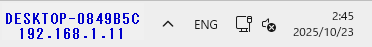
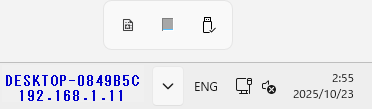
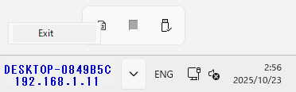

# Taskbar PC Info

Display PC information (hostname and IPv4 address) on the Windows 11 taskbar.

## Build

- Visual Studio 2022
- Build project
  - `.exe` file will be generated

## Run

- Run Builded `.exe` file

## Quit

- Click task tray

- Mouse right click on application icon
  - Select poppuped `Exit` context menu

## References

- This project was made using the [CS DeskBand](https://github.com/dsafa/CSDeskBand) library v3.1.0.
- The outline of this program's structure is based on the [TaskbarMonitorWindows11](https://github.com/leandrosa81/taskbar-monitor) application.
